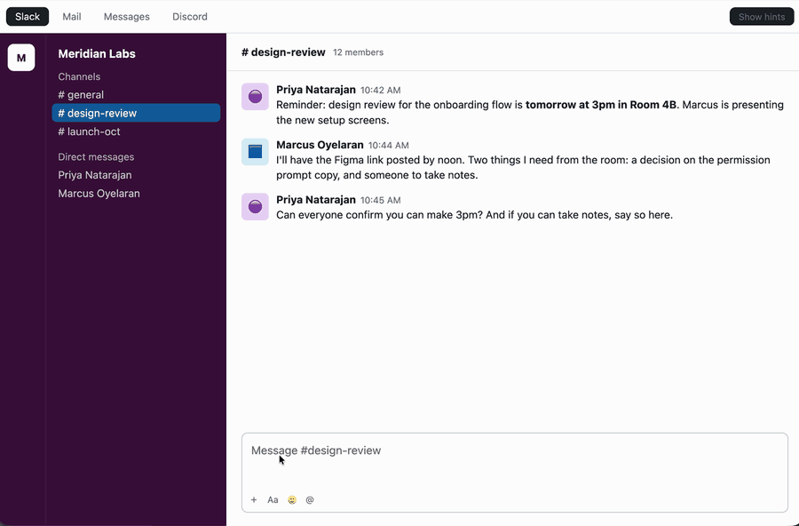
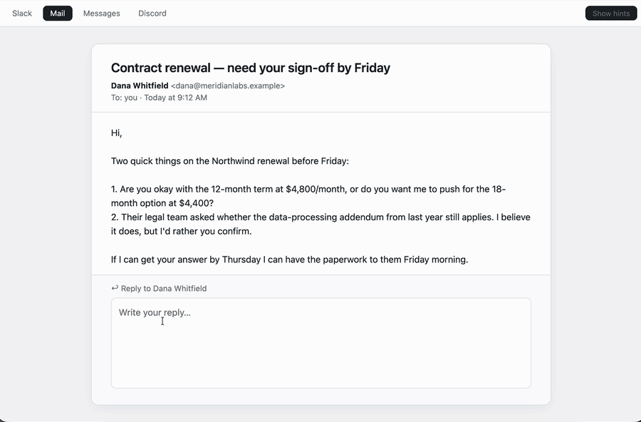
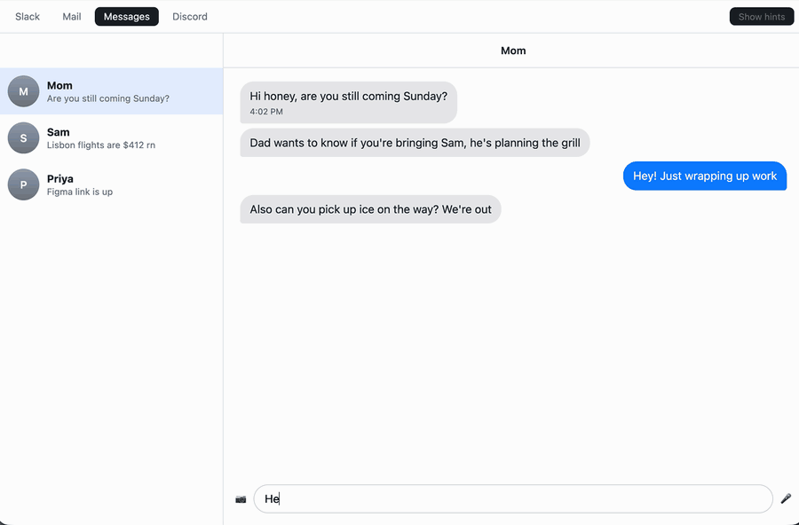
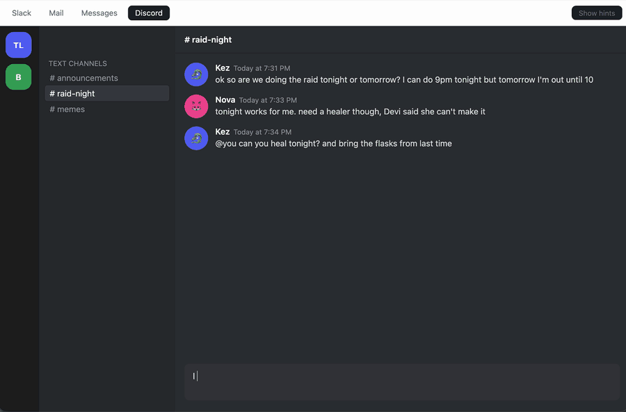

# Tilde


**A Mac keyboard that finishes your sentences. The AI runs on your Mac.
Nothing you type ever leaves it.**



## What it does

You type. Tilde shows the next few words in grey. Press `Tab` to take one
word, `~` to take all of them, or keep typing and it disappears.

It works in every app, because it is a real macOS keyboard, not a floating
window. Slack, Mail, Messages, Discord, Notes, Chrome, VS Code, all of them.

<details>
<summary>See it in Mail, Messages, and Discord</summary>







</details>

## Why it is different

- **Private.** The model runs on your Mac. No account, no cloud, no
  analytics. The only download is the model itself, once.
- **It reads the room.** With your permission, it looks at the message you
  are replying to, so a reply to "can you do 3pm?" actually answers it.
- **It learns you.** With your permission, it remembers how you write and
  prefers your own phrasing. Off by default.
- **It knows when to shut up.** It would rather say nothing than guess wrong
  in a sensitive conversation.

## Try it

**Without installing anything:** open [`demo/index.html`](demo/index.html)
in your browser. It has four fake apps with a card telling you what to type.

**The real thing:** you need an Apple Silicon Mac on macOS 26 or newer and
about 3.5 GB of disk for the model. There is no downloadable build yet, so
build it yourself:

```bash
./script/build_and_run.sh
./script/build_ime.sh
```

Then turn the keyboard on in System Settings, and give it Screen Recording
permission so it can see what you are replying to. Details are in
[docs/development.md](docs/development.md).

## Honest status

This is an open beta and my daily keyboard. It is not finished.

- Suggestions are good when the context is good, and wrong more often than I
  would like when it is not.
- In Chrome, Slack, VS Code, and other Chromium apps the ghost shows as
  thin underlined text instead of grey text. Those apps draw all pending
  keyboard text that way. Native apps like Mail and Messages show grey.
- It has been tested in the apps I use, which is a shorter list than the apps
  you use.

## For the curious

- [How it works and how to build it](docs/development.md)
- [How it is tested](docs/tilde-lab.md): every change is measured before it
  ships, and the [lab log](docs/research/lab-log.md) records what was tried
- [Privacy](PRIVACY.md): exactly what stays on your Mac and how

## License

[MIT](LICENSE). Free, no paid tier, none planned. The Tilde name and logo
are not part of the license, see [TRADEMARK.md](TRADEMARK.md). If you want
to support the work, use it and tell me what breaks.
