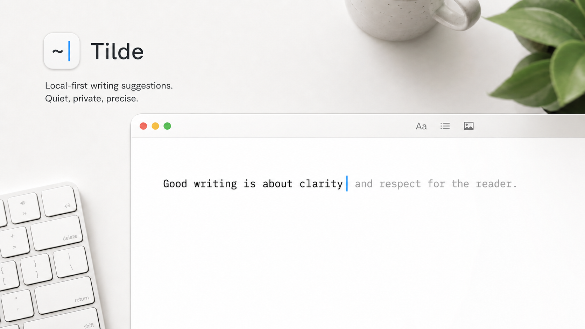

# Tilde



**Tilde finishes your sentences, in any Mac app, with a model that never
leaves your Mac.**

You type. A quiet grey ghost appears with the next few words. Press `Tab` to
take one word, `~` to take all of it, or keep typing and it gets out of the
way. It works in Slack, Mail, Notes, Chrome, Claude, VS Code, anywhere you can
type, because it is a real macOS keyboard, not a floating window.

<!-- demo: Assets/GitHub/tilde-demo.gif — fifteen seconds: type a Slack reply,
one Tab, one ~, one Esc. Record at 2x, crop to the composer. -->

Want to see it without installing anything into your real apps? Open
[`demo/index.html`](demo/index.html) in Chrome or Safari with the Tilde
keyboard selected: seven mock apps (Slack, Mail, Messages, Notes, GitHub, an
assistant chat, Discord), each pre-loaded with a conversation and a card that
tells you what to type. Nothing on the page talks to a network.

## What makes it different

- **It knows what you are replying to.** With your permission, Tilde reads
  the text on your screen, so a reply to "can you do 3pm?" gets a ghost that
  actually answers the question.
- **It learns how you write.** With your permission, it remembers your own
  phrasing and prefers it. Off by default.
- **Nothing leaves your Mac.** The model runs on your Mac. There is no
  account, no cloud, no analytics. The release process proves it by watching
  every socket the app opens while it works.
- **It stays quiet when it should.** Tilde would rather say nothing than
  guess wrong over a sensitive conversation, and it records every time it
  holds back, and why, so it can explain itself.

## Status: open beta

Tilde is my daily keyboard and it is free and open source under MIT. It is
not finished. The honest version:

- Suggestions are good when the context is good, and wrong more often than I
  would like when it is not.
- The filters that make it quiet and short are measured on my own test
  build and are being promoted to the default build through the same tests.
- It has been tested in the apps I use, which is a shorter list than the
  apps you use. See the [compatibility runbook](docs/compatibility/app-compatibility-runbook.md).
- In Chrome, Slack, Claude, VS Code, and other Chromium or Electron apps the
  ghost shows as faintly underlined text rather than grey text. Those apps
  draw every input method's pending text with an underline and ignore its
  colour; Tilde keeps the underline as thin and light as they allow. Native
  apps such as Notes, Mail, and Messages show the grey ghost.

Requirements: an Apple Silicon Mac on macOS 26 or newer, about 3.5 GB of
disk for the default model, and one trip to System Settings to enable the
keyboard. Screen Recording permission is required for suggestions; without
it Tilde stays silent.

## How it works

Tilde is three small pieces:

1. **The keyboard** (`InlineGhostIME`) handles your keystrokes and draws the
   ghost as marked text inside the app you are typing in. It never inserts
   text through Accessibility, overlays, or fake paste events.
2. **The app** in the menu bar takes a bounded slice of what you typed, adds
   what it can see on screen, asks the model, filters the answer, and sends
   back a short suggestion over a private local socket.
3. **The model** is a signed copy of `llama-server` running as a child of
   the app, with one of two pinned open-weight models downloaded on first
   run and verified byte for byte:
   - **Gemma 4 E2B** (default, 3.4 GB) — lighter, measured.
   - **Qwen 3.5 9B** (optional, 5.6 GB) — stronger, needs more memory,
     still under study.

Typed text, screen text, and model output stay in memory and are gone when
the request is done. If you turn on Personal History, what you write is
stored on your Mac in an encrypted log whose size you can see, that you can
exclude apps from, and that you can delete with one click. [PRIVACY.md](PRIVACY.md) has the full boundary.

## How I know it works

Every change to what Tilde shows goes through a research harness in this
repository called Tilde Lab. Experiments are registered with a kill rule
before they run, results are written down whether they won or lost, and
nothing reaches the default build without a measured comparison against the
build it replaces.

- [Experiment records](docs/experiments/README.md) — Q11 to Q14 are the
  chain that took wrong-when-shown on the tuned stack from the forties into
  the teens. Q13 is the one that killed my own favourite idea, longer ghosts.
- [The lab log](docs/research/lab-log.md) — every attempt: what was tried,
  what was learned, what failed, written the same day.
- [The learning ledger](docs/learning-ledger.md) — the reusable lessons and
  the ordered queue of what may run next.
- The live outcome ledger — a text-free record of every ghost shown and
  every silence, with its reason, kept on your Mac and never uploaded.

## Two parts, one repository

| Name | Purpose | Ships to users? |
| --- | --- | --- |
| **Tilde** | The macOS input method and its local runtime | **Yes** |
| **Tilde Lab** | The app and command-line tools used to test and improve Tilde | **No** |

The boundary is enforced by Swift package dependencies: Tilde Lab may use
`TildeCore`, but the app and keyboard never import anything from Tilde Lab.
See the [repository boundary map](docs/repository-boundary.md).

### Pinned model assets

The picker offers exactly two immutable files and needs no Hugging Face login:

- `https://huggingface.co/mradermacher/gemma-4-E2B-GGUF/resolve/3762686d74ff8db6c98f8d3c389f56fbdf994d5a/gemma-4-E2B.Q4_K_M.gguf`
  — 3,427,861,984 bytes; SHA-256
  `389c868898bffed97fd178646f88562cafecc6f60983a636bac53b131fd068a2`
- `https://huggingface.co/mradermacher/Qwen3.5-9B-Base-GGUF/resolve/ec5c6b42ca313fc71afe4a40b068d3f7026bf4f6/Qwen3.5-9B-Base.Q4_K_M.gguf`
  — 5,629,109,312 bytes; SHA-256
  `4171d5fec62a373744ca4f01ec9e2378c092a65f480c039e9c679d910351fda2`

The first-run download is the only network request Tilde ever makes. It
sends no typed text, screen text, prompt, history, or model output.

## Development

The project is a Swift 6.2 package with no Xcode project file.

```bash
./script/proof.sh fast
./script/build_and_run.sh
./script/build_ime.sh
```

The two build scripts create development bundles; they do not contain the
release model or helper. By default, both require the one eligible Apple
Development identity in the keychain, so the app and IME receive matching,
non-empty Team IDs. If multiple identities exist, pass the same exact SHA-1 to
both with `--sign-identity`. Explicit `--sign-identity -` builds ad hoc bundles,
which cannot exercise the authenticated app-to-IME runtime.
`script/proof.sh fast` is the pre-merge gate.
`script/package_app.sh` is the single manual release driver. It requires the
helper hash and explicitly named Gemma and Qwen proof-model preseeds. Both are
checked against their revisions, byte counts, and SHA-256 pins above, copied
only into isolated external proof storage, and never into the signed app. The
driver exercises both selections and then blocks on bundle shape, helper/IME signatures, runtime health,
steady-state open-socket observation, notarization, Gatekeeper checks, and a
32 MiB hard cap on the signed app artifact. Run
`./script/package_app.sh --help` for the full command. The pins must come from
human review: matching bytes and valid file shapes do not prove provenance.

For private, aggregate-only model comparisons, see the
[evaluation guide](docs/evaluation.md).

Tilde Lab is the separate local regression studio for reply quality, judgment,
Scene Memory, synthetic personalization, real text-system interaction, and
performance experiments. It runs reproducible multi-arm suites through the
pinned loopback-only Gemma runtime, includes deterministic policy audits and an
instrumented AppKit Scene Host, and persists aggregate-only reports for
baseline/candidate comparison. Its locked headline is **Net Keystrokes Saved**,
with safety, bad-suggestion, temporal-integrity, privacy, interaction, and
latency gates outside the number. The `tilde-lab` CLI adds durable
work-item resume, interleaved paired blocks, a hard development/validation/
holdout firewall, root-clustered uncertainty, risk–coverage, chronological
personalization, local dogfood/attention-tax and confidence calibration,
real-host evidence, soak gates, and immutable permanent regressions. It
includes a 300-case protected curated
Slack pack with prefix replay/context ablations, the 400-case synthetic quiz,
and a read-only development-only importer for private accepted/typed-instead
history:

```bash
./script/build_and_run.sh --tilde-lab
swift build --product tilde-lab
.build/debug/tilde-lab init --name qwen-factorial --hypothesis-id QWEN-GEN-01 --hypothesis "The registered treatment improves expected utility without increasing harm." --class generator --suite certified-v2 --output campaign.json
.build/debug/tilde-lab run campaign.json --resume
.build/debug/tilde-lab review --campaign campaign.json --status supported --conclusion "The preregistered criteria passed; see the experiment record."
.build/debug/tilde-lab compare --campaign campaign.json
swift run tilde-lab-runner --workers 1 --slots 8 --repetitions 10
swift run tilde-lab-runner --built-in-suite slack-reply-gold-v1
swift run tilde-lab-runner --manifest ./candidate-matrix.tilde-lab.json
```

See the [Tilde Lab guide](docs/tilde-lab.md) for the complete knob manifest,
score and privacy contracts, scenario format, matrix runner, and the boundary
between high-throughput model evidence and foreground real-IME proof. The
[Tilde Learning Ledger](docs/learning-ledger.md) preserves what experiments
taught us, why candidates were kept or rejected, and what should be tested next.
The [research roadmap](docs/research-roadmap.md) sequences the longer-term
hypotheses behind that queue, while [experiment records](docs/experiments/README.md)
define the public pre-registration and result format.

The code follows the same two-part boundary:

- **Tilde:** `Sources/TildeCore`, `Sources/TildeApp`, and
  `Sources/InlineGhostIME`.
- **Tilde Lab:** `Sources/TildeLabKit`, `Sources/TildeLab`,
  `Sources/TildeLabCLI`, and `Sources/TildeLabRunner`.

The names inside each group describe implementation components, not additional
products.

Read [AGENTS.md](AGENTS.md) before changing behavior.

## Privacy

Tilde may retain writing locally when it provides direct user benefit. Personal
writing data remains on the user's device, is controlled by the user, and is
never transmitted for inference, analytics, or training. See
[PRIVACY.md](PRIVACY.md) and the current
[threat model](docs/security/threat-model.md).

## License

[MIT](LICENSE). Use it, fork it, build on it. The Tilde name, icon, and logo
are not part of the license; see [TRADEMARK.md](TRADEMARK.md), which only
asks that a modified version be called something else. Third-party components
keep their own licenses; `llama.cpp`, for example, is MIT too.

There is no paid tier and none is planned. If you want to support the work,
use it, report what breaks, and tell me what it should do next.
