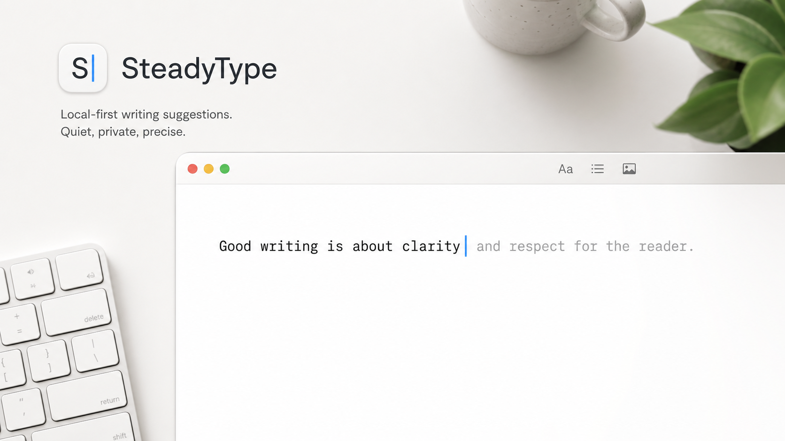

# SteadyType



SteadyType is a small Mac app for quiet writing suggestions near your cursor.

It watches the active text field, shows a short suggestion, and only inserts text when you accept it. The question for this beta is simple: does this make writing feel easier, or does it get in the way?

Current proof truth: the private beta is still blocked until the live proof
gates are green. The strict manual smoke gate now tracks only the boring
beta-safe rows, so app support stays narrow and proof-gated.

## What It Does

- runs as a macOS menu bar app
- reads the focused text field through Accessibility
- shows a small suggestion near the cursor
- uses `Tab` to accept one word
- uses `Esc` to dismiss
- runs local-first by default
- keeps app support proof-gated instead of pretending it works everywhere

## Current Beta Scope

The first target apps are:

- TextEdit
- Apple Notes
- Obsidian
- Chrome local textarea/contenteditable practice fixtures only

These are beta targets, not a broad compatibility promise. Prompt and chat apps
stay heavily guarded. Codex and Claude-style fields are proof-gated because
accepting text must never submit a prompt by surprise.

## Privacy

SteadyType is local-first. Typed text, prompts, model output, accepted text, screenshots, document names, URLs, recipients, and subject lines are not uploaded by default.

Diagnostics are local and redacted unless a tester explicitly opts into a short-lived raw or screenshot trace for debugging.

## Personal Capture

Personal Capture is a local, opt-in Justin dogfood loop. It writes daily
Markdown on this Mac so the app can learn from real writing and accepted-kept
suggestions. It is not telemetry, not a beta requirement, and not enabled for
customers or testers by default.

Useful docs:

- [Beta privacy](PRIVACY-BETA.md)
- [Known limitations](KNOWN-LIMITATIONS.md)
- [Diagnostic export](DIAGNOSTIC-EXPORT.md)
- [Personal Capture](docs/product/personal-capture.md)
- [Uninstall and delete data](UNINSTALL-DELETE-DATA.md)

## Runtime

The app owns the model runtime. Testers should not need to start Ollama, llama.cpp, Python, or any other server.

The current local runtime path uses MLX on Apple Silicon and downloads one pinned default model revision once. The beta gate checks the local checksum receipt before calling the model ready.

## What This Is Not

- not part of another product yet
- not a cloud-first writing assistant
- not personalization
- not a broad compatibility claim
- not a full release

## Development

```bash
swift test
./script/check_test_coverage_manifest.sh
./script/build_and_run.sh --verify
```

Full private beta validation lives in:

```bash
./script/beta_readiness.sh
```

The repo also includes smoke tests, privacy checks, runtime checks, proof manifests, and visual placement evidence under `script/` and `docs/product/`.
